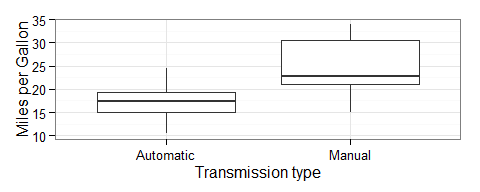
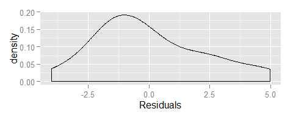
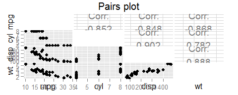

# Motor Trend analysis - Coursera Regression course project
Leon Duplay, 22/07/2015  
<style type="text/css">
body, code.r, pre{
  font-size: 10pt;
}
h2,h3,h4,h5,h6{
  font-size: 12pt;
}
h1{
  font-size: 16pt;
}
</style>

### Executive summary

The purpose of this analysis is to use the 1974 Motor Trend US magazine data to understand the different vehicle variables (number of cylinders, weight, gears, hp, transmission mechanism) impact on mpg. We'll focus on the followng question and quantifying the result: *Is an automatic or manual transmission better for MPG?*

Results show that manual cars reach on average 7.24 more miles per gallon than automatic transmission cars. The transmission type is in effect a confounding variables for weight, displacement, and number of cylinders - the most statistically significant variables in regards to mpg. This suggests in our sample dataset the automatic cars were heavier, had higher displacement, and more cylinders.

### Exploratory Data Analysis of mtcars

We will start looking at the data in a general sense to understand if the transmission has an impact on mpg and whether one is higher than the other. We therefore use the transmission variable `am` as factor and explore the data using ggplot2 boxplots.


```r
data(mtcars)
mtcars$am <- factor(mtcars$am,labels=c('Automatic','Manual'))

# explore data
library(ggplot2)
ggplot(mtcars, aes(x = am, y = mpg)) + geom_boxplot() + theme_bw() + 
    labs(x = "Transmission type", y = "Miles per Gallon")
```



These simple plots show that **manual transmission cars have higher MPG than automatic on average** (and also have more variance in the results). In addition, the kind of transmission is not the only variable that has an impact on mpg - the Pairs figure in the appendix shows that **several other regressors have a strong correlation** (a higher mpg means higher displacement, higher weight, or more cylinders).

### Single Variable Regression

In order to ascertain the impact of `am` on `mpg` we will use a linear regression model by using `am` as a factor variable.


```r
fit <- lm(mpg ~ am, data = mtcars)
summary(fit)$coef
```

```
##              Estimate Std. Error   t value     Pr(>|t|)
## (Intercept) 17.147368   1.124603 15.247492 1.133983e-15
## amManual     7.244939   1.764422  4.106127 2.850207e-04
```

Since `am` is a factor, the Intercept value in this case is the mean of the Automatic mpg (see boxplot above), and the amManual slope is the difference in means between the Automatic and Manual transmission cars. Therefore, **the difference in means is 7.24. The p-value of being below 0.05 (95% confidence interval) we can disprove the null hypothesis  and conclude this difference in means is statistically significant.** 

However, the R2 results show that the model is only able to predict **36%** of the variance in mpg. Since we know that several other variables act as confounders, we will use multivariate regression to analyse multiple models of regressors in the next section.

### Multivariate regression

In order to find and select the best model to use including our other variables we will do nest model testing using the `anova` function in order to find the variables that impact the most our system, and then build a model with these, taking also into account their interaction.


```r
fit2 <- lm(mpg ~ ., data = mtcars)
anova(fit2)
```

```
## Analysis of Variance Table
## 
## Response: mpg
##           Df Sum Sq Mean Sq  F value    Pr(>F)    
## cyl        1 817.71  817.71 116.4245 5.034e-10 ***
## disp       1  37.59   37.59   5.3526  0.030911 *  
## hp         1   9.37    9.37   1.3342  0.261031    
## drat       1  16.47   16.47   2.3446  0.140644    
## wt         1  77.48   77.48  11.0309  0.003244 ** 
## qsec       1   3.95    3.95   0.5623  0.461656    
## vs         1   0.13    0.13   0.0185  0.893173    
## am         1  14.47   14.47   2.0608  0.165858    
## gear       1   0.97    0.97   0.1384  0.713653    
## carb       1   0.41    0.41   0.0579  0.812179    
## Residuals 21 147.49    7.02                       
## ---
## Signif. codes:  0 '***' 0.001 '**' 0.01 '*' 0.05 '.' 0.1 ' ' 1
```

The results show that the variables `cyl`, `wt` and `disp` show statistically significant impact on mpg (in line with our exploratory data analysis above). However, `am` is *not* statistically significant and therefore should not be used as a predictor - it is basically a **confounding variable**. Since `disp` also shows a strong correlation with `wt`, we will also include the interaction in the model. Our chosen best fit model is therefore:


```r
fit3 <- lm(mpg ~ wt + as.factor(cyl) + disp + disp:wt, data = mtcars)
```

With an **R2 of 0.86**, our model has a much better fit to explaining `mpg`. In addition, we can see by performing our linear regression fit with this multivariate fit shows a p-value strongly under 5% (see Appendix Model Comparison), so we can reject the hypothesis that our newly added variables do not contribute information around variance in mpg.

### Conclusions

* A manual transmission is better for MPG than automatic for these samples in the dataset
* The mean difference in mpg between the two is 7.24
* Number of cylinders, weigth and displacement have the biggest influence on MPG: the smaller they are, the greater is MPG.

### Residuals analysis


```r
qplot(resid(fit3),geom="density") + xlab("Residuals")
```



We can see that the residuals seem to be correctly normally distributed, although the mean is slightly off from 0. We can therefore improve our model by taking into account additional variables.

### Appendix

Pairs plot


```r
library(GGally)
ggpairs(mtcars[,c("mpg","cyl","disp","wt")], 
    diag = list(continuous = "blank"), title = "Pairs plot")
```



Model comparison


```r
anova(fit,fit3)
```

```
## Analysis of Variance Table
## 
## Model 1: mpg ~ am
## Model 2: mpg ~ wt + as.factor(cyl) + disp + disp:wt
##   Res.Df    RSS Df Sum of Sq      F    Pr(>F)    
## 1     30 720.90                                  
## 2     26 158.08  4    562.81 23.142 3.022e-08 ***
## ---
## Signif. codes:  0 '***' 0.001 '**' 0.01 '*' 0.05 '.' 0.1 ' ' 1
```


